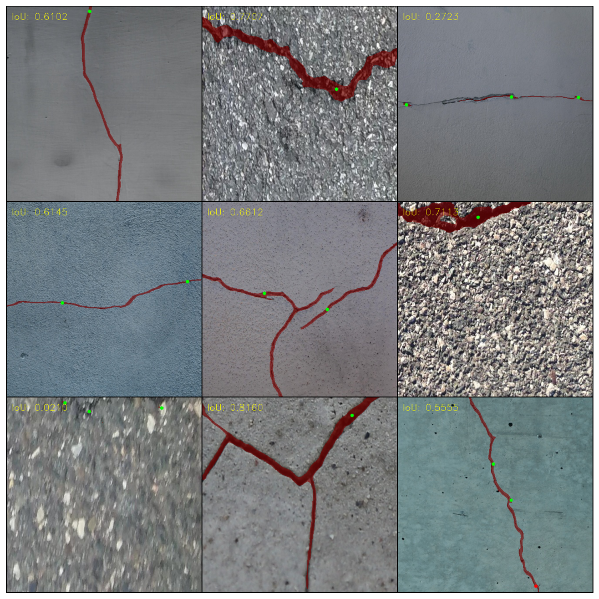
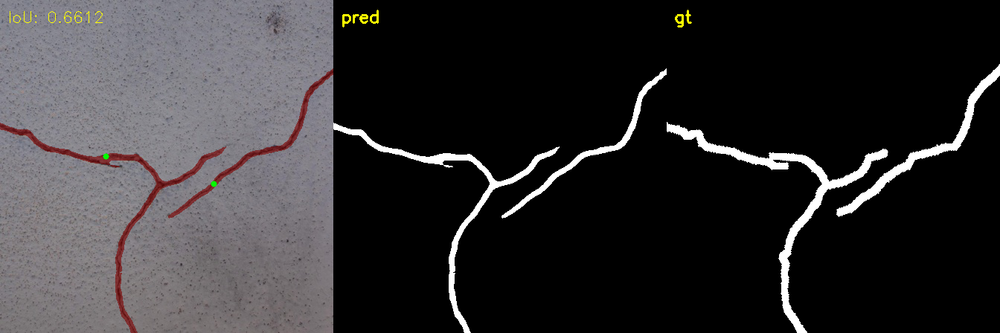

## Training ClickSEG HRNet18 on custom Cracks Dataset

Checkpoints: https://drive.google.com/drive/folders/1v7KxJenZzYii6Dh7Ad2ePKn4SinSS4Q7?usp=sharing

Generally, for achieving a good predictions on cracks only 1-3 clicks is needed on avg., but the model often do the job in 1 click:

### Trained model info:
- **Model**: HRNetV2-W18 S2
- **Pretrained**: ImageNet
- **Input size**: 256, 256
- **Train data count**: 9603
- **Batch size**: 40
- **Epochs trained**: 23
- **Val. Metric (AdaptiveIoU)**: 0.5788

### Val. Metrics (FocalClick hrnet18), 500 test samples:

| NoC@40.0% | NoC@45.0% | NoC@50.0% | NoC@55.0% | NoC@60.0% |
|-----------|-----------|-----------|-----------|-----------|
| 1.76      | 2.29      | 2.91      | 3.71      | 4.87      |

| IoU at 1 clicks | IoU at 2 clicks | IoU at 3 clicks | IoU at 5 clicks | IoU at 15 clicks |
|-----------------|-----------------|-----------------|-----------------|------------------|
| 0.6280          | 0.6340          | 0.6386          | 0.6504          | 0.6825           |

### There are several changes from the original clickSEG repo:
- Fixed data loading in ISDataset. Without this fix some training samples was skiped (isegm/data/base.py)
- Added validation step with NoC metrics while training
- More augmentations in training
- Updated to last version of albumentations
- Removed dependency on mmcv (for HRNet)
- Better eval script, more metrics
